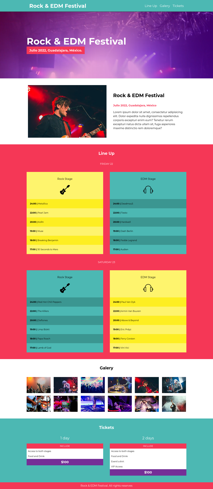

# Rock & EDM Festival

This is project form part of my portfolio, and was initially built in with HTML, CSS, GULP and SASS you can see the old version on this site [Music Festival](https://github.com/jaac97/Music-festival), in this new version we use React, as well React Hooks

## Table of contents

- [Overview](#overview)
  - [The challenge](#the-challenge)
  - [Screenshot](#screenshot)
  - [Links](#links)
- [My process](#my-process)
  - [Built with](#built-with)
- [Author](#author)

**Note: Delete this note and update the table of contents based on what sections you keep.**

## Overview

### The challenge

Users should be able to:

- View the optimal layout for the component depending on their device's screen size

### Screenshot

### Links

- Solution URL: [GitHub Respository](https://github.com/jaac97/music-festival-react)
- Live Site URL: [Netlify](https://fascinating-dango-96176b.netlify.app/)

## My process

### Built with

- React
- GULP
- SASS
- Block Element Modifier
- Responsive Web Design

## Author

- LinkedIn - [Josué Alarcón Camino](https://www.linkedin.com/in/josue-alarcon-camino/)
- Frontend Mentor - [@jaac97](https://www.frontendmentor.io/profile/jaac97)

